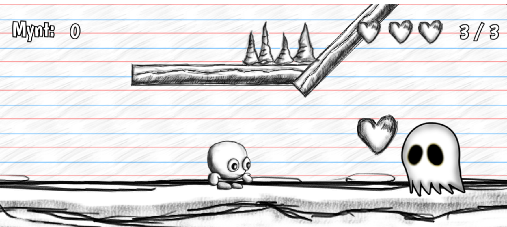

# En guide till Hello Library
## Ett paket med kom igång-kod till ditt egna 2D-spel i Defold!

### Detta dokuments uppbyggnad

1. Introduktion till Hello Library (FAQ)
2. Olika 2D-spel
    - Sidescrollern
    - Top-Down
3. Skripten i Hello Library 
    - Hero  
    - Skadehantering 
    - Rörlig fiende 
    - Pick-ups

### Introduktion till Hello Library (FAQ)

*Vad är Hello Library?*

> Hello Library är ett paket med kom igång-kod, i form av moduler och skript, som du kan referera till i ditt spel. Det är tänkt att hjälpa dig som inte är redo att skriva all kod själv från början. Koden är en grund som du kan bygga vidare på och göra dina egna ändringar i, utifrån hur ditt spel ser ut!

*Hur importerar jag Hello Library till mitt projekt?*

> I filen `game.project` finns ett fält **dependencies** där du ska fylla i länken https://github.com/helloworld-se/HelloLibrary/archive/master.zip​. Spara filen och tryck på >
**Fetch Libraries** under menyn → “Project”. Hello Library kommer nu att dyka upp i projektfönstret (​*project explorer*​). Där kan du se koden, men inte ändra i den. Vill du modifiera filer så får du göra en lokal kopia.

*Vad för spel kan jag göra med hjälp av Hello Library?*

> Koden i Hello Library är framtagen för 2D-spel i Defold av typen
>
>**Sidescroller**
>
>- **Klassisk.** Ex: ​*Super Mario*
>
>- **Autorunner.** Ex:​ *Robot Unicorn Attack* 
>
>**Top-Down**
>
>-  Ex: ​*The*​ ​*Legend of Zelda*

*Hur är koden skriven?*

> Koden är uppdelad mellan två komponenter: ​*moduler* ​och ​*skripts*​. Om vi ser det som flera olika lager, så är modulerna längst ned, sedan kommer skripten och sedan kommer alla spelobjekt (tillsammans med “resten” komponenterna i spelet). I modulerna ligger helt enkelt kod som skripten kan använda sig av och som är mindre viktiga att ha koll på för dig som användare av biblioteket. Om du bara ska göra mindre ändringar i koden till ditt spel kan det alltså räcka med att göra de i skripten, men om du ska göra större ändringar kan du behöva gå in i modulerna. All kod är i programmeringsspråket Lua.

---

### Olika 2D-spel

Här följer en snabb introduktion till vilka speltyper som Hello Library stöder. Det är klassiska spel i 2D som du alldeles säkert testat på förut. Med relativt små ändringar går det att variera spelen mycket!

**Sidescroller**

*Sidescrollern*​ är ett klassiskt 2D-spel med en vy ifrån sidan av en värld. Vanligtvis rör sig karaktären från vänster till höger med något mål – samla poäng genom att plocka upp saker eller kanske bara överleva så länge som möjligt. Detta spel finns i två varianter: den där spelaren aktivt måste be karaktären att röra sig framåt genom input och den där karaktären automatiskt rör sig åt framåt. Ett exempel på det förstnämnda, som vi här kallar ​*klassisk sidescroller*​, är Super Mario och ett exempel på det andra är Robot Unicorn Attack, en så kallad ​*autorunner*.​ Koden är väldigt lik, men med någon liten skillnad.

**Klassisk Sidescroller**

Skripten som är specifika för den klassiska sidescrollern ligger i mappen: 
> `HelloLibrary/Scripts/Sidescroller` 

Till de olika spelobjekten, använd de här skripten: 
- Hero:​ `​Hero.script`

- Fiender​: `​DamageDealer.script`

**Sidescroller Autorunner**

För att göra en autorunner, använd exakt samma script som för sidescrollern, men...

**Top-Down**

*Top-Down*​ är en annan klassisk typ av 2D-spel med ett ovanifrånperspektiv. Här kan vi bygga banorna åt vilket håll som helst. Här finns det inte någon gravitation som verkar “nedåt” på karaktären (gravitationen här går ju rakt ned i marken, dvs in i skärmen!), vilket det ofta, men inte alltid, finns i ​*sidescrollern*​.

Skripten som hör till top-down-spel ligger i mappen 
> `HelloLibrary/Scripts/TopDown` 

Till de olika spelobjekten, använd de här skripten: 

- Hero: `​Hero.script`

- Fiender​: `​DamageDealer.script`

### Skripts i Hello Library

**Hero**

`Hero.script`

Alla 2D-spelen som Hello Library stöder har en huvudkaraktär som styrs av spelaren. Mycket av spelets funktion hör till spelobjektet för denna huvudkaraktär, som vi brukar kalla “hero”. I hero-skriptet kopplas alla dessa funktioner ihop och vi får användning av många av modulerna.

I Hello Library finns två varianter på hero-skripts; en för sidescrollern och en för top-down. De ligger i 

>HelloLibrary→Scripts→Sidescroller -> `​Hero.script`

och i 

>HelloLibrary→Scripts→Topdown ->`​Hero.script​`

**Skadehantering**

`DamageDealer.script`

När en råkar gå in i en fiende, rörlig som stillastående, måste vi hantera detta. För det första måste vi registrera detta och dra bort ett “liv”. För det andra vill vi att hero ska studsa tillbaka lite när den går in i en fiende, för annars skulle det kunna gå åt flera liv på ett misslyckande i och med att en fortfarande har kontakt med fienden i flera uppdateringar. I skadehanteringsskriptet bestämmer vi hur hero ska studsa på fienden och ser till att ett liv dras.

Det finns två snarlika versioner av detta skript; ett som är anpassat för sidescrollern och en för top-down.

**Rörlig fiende**

`Patrol.script`

För att göra en fiende rörlig, dvs att den “patrullerar”, så är det bara att lägga till ett skript som flyttar på denna fiende genom att anropa liknande funktioner som används för att flytta hero. Detta skript för så att en fiende patrullerar fram och tillbaka. Det är enkelt att ändra hur lång sträcka som den patrullerar över och hur fort den får genom att definiera om egenskaperna ​*move speed*​ och *patrol distance*​ ​(som hittas i skriptfilens property-fönster).

**Pick-ups**

`Heart.script & Coin.script`

Om du vill använda dig av så kallade pick-ups (saker du kan plocka upp) så finns dessa skript till hjälp. De gör så att objektet försvinner då hero går in i det och meddelar spelobjektet att det har skett, vilket i sin tur betyder att en räknare tickar upp.

Här har vi två olika varianter; ​heart.script​ som är motsvarar hur många liv spelaren har och ​coin.script​ som är till för att hålla räkningen på poäng. De är snarlika, med enda skillnaden vilket meddelande som skickas till spelobjektet.